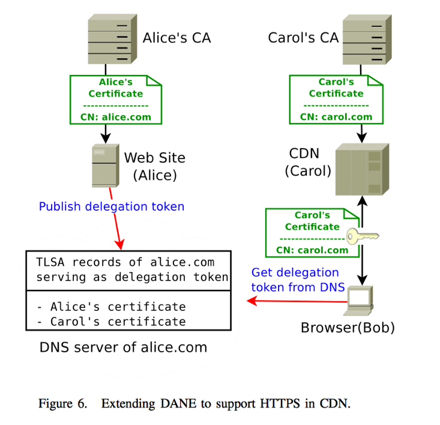

# When HTTPS Meets CDN: A Case of Authentication in Delegated Service

**1.**     **论文题目**

**When HTTPS Meets CDN: A Case of Authentication in Delegated Service**

作者：Jinjin Liang, Jian Jiang, Haixin Duan, Kang Li, Tao Wan , Jianping Wu

 

**2.**     **文章概述**

这篇文章提供了一个针对CDN和HTTPS两者的系统的研究，了解两者如何共同部署与合作。 文章使用HTTPS检查了20个流行的CDN提供商和10,721个客户网站。研究揭示了CDN供应商当前采用的HTTPS策略在实践中存在的各种问题，例如广泛使用无效证书、私钥共享、陈旧的证书的撤销不及时以及不安全的后端通信。虽然其中的一些问题只是部署上的问题，但其他问题根植于HTTPS的端到端性质与委托服务中涉及多方的CDN的中间人之间的基本语义冲突。为了解决HTTPS遇到CDN时的代理问题，文章提出并实现了一种基于DANE（基于DNS的命名实体认证）的轻量级解决方案。这是一种新兴的IETF协议，补充了当前的Web PKI模型。 在文章的实现方案下，HTTPS可以安全有效地与CDN共同使用。

**3.**     **主要内容**

内容分发网络（CDN）和超文本安全传输协议（HTTPS）是两个流行但互相独立的网络技术，两者都已经被独立地研究与分析。当HTTPS融入CDN后，通信者从两方变成了三方。这与HTTPS本意上的设计有冲突。尤其当网站启用HTTPS并使用带有基于DNS的请求路由的CDN时，可能会发生证书名称不匹配，因为DNS的重定向在HTTPS的身份验证中是透明的。

主要存在两个问题：

1. 前端问题

   前端一般采用两种方式来进行联合部署。

   - 自定义认证.

     该方法的问题：1.Web与CDN供应商共享了一个私钥，违反了公钥体制，会造成很多额外的攻击与危险2. 无法独立撤销

   - 分享证书

     该方法问题：1. 共享证书虽然解决了自定义认证的问题，但是会削弱证书安全指标的功能。2. 无法独立撤销

   前端的问题是由于CDN与HTTPS联合部署时，产生的语义冲突。

2. 后端问题

   因为一些CDN产商对该问题的不重视，在实现部署方面存在一些问题。在测试过程中，发现一些产商甚至直接使用http在后端连接，而一些产商虽然使用了HTTPS，但是没有在建立安全通道时建立适当的身份验证，易受到MITM攻击。

   而对于这些问题的解决方案如下几种：

   1. 尝试名称约束的技术

      在这种方法中，网站所有者扮演从属CA的角色，向CDN提供商发布证书，限制到所有者的域。 

      然而这种方法存在一些局限性，不适用实际：

      - 在一些流行的浏览器中，可以通过漏洞轻松绕过
      - 运行从属CA会对网站所有者造成沉重的负担
      - 因为沉重的审查和审计责任，商业CA不大有可能有动机允许他们对客户是从属CA

   2. 基于DANE为基础提出了一个新的解决方案（本文提出的方案）

      在这个解决方案中，网站所有者可以向他的代表团显示他的TLSA记录，该记录将网站和CDN提供商的证书相关联。 因此，最终用户可以验证原始网站和CDN提供商的身份以及它们之间的委派。 通过分析和实现表明，该解决方案可以有效地解决CDN中的HTTPS问题。

      

      该方案能满足三大需求：1. 委派令牌不可伪造2. 委托人能独立有效地签发和撤销委托令牌 3. 委托令牌能包括委托人的完整识别，能保持HTTPS证书的有效功能，显示适当的安全指示

 

 

**4.**     **心得体会**

这篇论文主要对CDN与HTTPS共同部署时，可能产生的冲突进行了分析。研究发现由于CDN与HTTPS本身语义的冲突和相关产商部署时候的不重视，当下CDN与HTTPS联合部署时会产生很多问题。主要分为前端问题和后端问题。后端问题主要是由于产商的不重视造成的，值得警示与及时修正；前端问题，是由于基本语义的冲突。CDN产商在缓和这些基本冲突时，主要采用了自定义证书或者分享证书的技术。然而，这些技术在实际运行时，存在一些比较严重的问题。自定义认证技术需要客户与CDN产商共享一个私钥，这严重违反了公钥体制，会造成很多额外的攻击与威胁。分享证书依靠CA颁发对多个域名有效的证书，这种情况下一些证书会退化，无法显示较高级别的绿色标志。此外，这两种技术都无法独立的撤销。为了解决这个问题，作者先考量了名称约束的技术。然而，发现该技术存在一定的局限性，不适宜部署。最后，作者提出了一个基于DANE的轻量级解决方案。该方案在未来DANE广泛部署时，具有极好的优越性，且能较好地解决当下CDN与HTTPS冲突的问题。此外，该方法在开销上也较小，值得推荐。