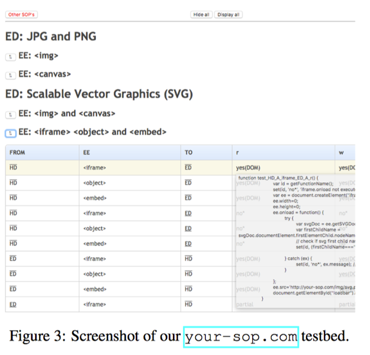

# Same-Origin Policy: Evaluation in Modern Browsers

**1.**     **论文题目**

**Same-Origin Policy: Evaluation in Modern Browsers**

作者：Jörg Schwenk, Marcus Niemietz, and Christian Mainka, Horst Görtz Institute for IT Security, Chair for Network and Data Security, Ruhr-University Bochum 

**2.**     **文章概述**

同源策略（SOP）是用于管理不同源的Web应用程序之间交互的一组复杂规则。论文主要研究SOP规则的子集，即如何控制主文档和嵌入文档之间的交互。

研究者们在10个主要网络浏览器上运行了544个不同的测试用例。测试结果表明，SOPDOM 授予的访问权限至少以来三个属性：嵌入元素（EE）的类型、沙箱和CORS属性。此外，由于SOP缺乏正式的规范，不同的浏览器实现会有不同程度的不同。最终，在实际运行过程中针对同一个样例会显示出不同的运行结果，这些轻微的异同，很容易会成为恶意攻击者的突破点，进而危害浏览器安全。

**3.**     **主要内容**

同源策略（SOP）是保护Web应用程序最重要的安全机制，它把拥有相同主机名、协议和端口的页面视为来自同一个来源，它主要的意图是限制不相同的元之间进行通信。

然而，至今SOP都没有完全规范的正式定义，标准化进程尚未完整。因此，各个主流浏览器的实现均有轻微的不同。针对这些问题，研究者们进行了详尽的测试与分析，其主要贡献在于：

1. 系统地测试了SOP的边缘案例，通过这些案例探究嵌入元素、CORS和沙箱属性对SOP的影响；

2. 提供了一个测试平台，可以对浏览器的SOP进行自动测试和可视化；

3. 测试平台可以测试544个测试样例，并在测试过程中能够较好地区分和描述这些差异的系统方法；

4. 通过针对IE和Edge的基于CSS的登录Oracle攻击，研究发现使用ABAC规则对CSS可以进行跨源攻击；

5. 此外，研究者批判地讨论了标准访问控制模型（DAC、RBAC和ABAC）对SOP-DOM的适用性。

具体的测试效果如下所示：

                 

通过对比与讨论不同访问控制模型的需求与考量，作者认为SOP-DOM的一般规则必须可以不参考Web主题或对象的URL或HTML上下文来白噢单，并且可以应用SOP-DOM规则，每个Web对象的URL和HTML上下文必须转换为抽象描述，然后将作为一般SOP-DOM规则的输入。因此，DAC并不是很适合SOP-DOM规则，eRBAC和ABAC相对较为符合。

**4.**     **心得体会**

这篇文章是针对SOP进行了一个详尽的分析与测试，研究者分析了SOP-DOM在浏览器交互过程中的每一种可能性。而又因为SOP的非标准化，导致不同的浏览器对同一样例的反馈具有不一致性。这种不一致性很有可能导致安全漏洞。

我们在研究过程中，可以特别关注这些非标准化规范导致的实现不一致，很有可能这种不一致会在部分情况下导致严重的安全漏洞。