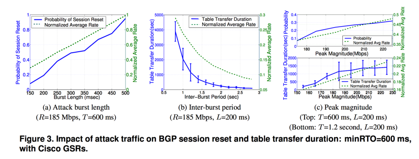

# Low-Rate TCP-Targeted DoS Attack Disrupts Internet Routing

**1.**     **论文题目**

**Low-Rate TCP-Targeted DoS Attack Disrupts Internet Routing**

作者：Ying Zhang University of Michigan wingying@umich.edu,Z. Morley Mao University of Michigan zmao@umich.edu,Jia Wang AT&T Labs–Research jiawang@research.att.com

**2.**     **文章概述**

本文针对低速率的TCP-BGP Dos攻击进行了研究与分析。

边界网关协议（BGP）是当下最常用的Internet域间路由协议之一，它使用TCP作为其传输协议。 研究者详细测试与探究了这种攻击时如何破坏当今互联网上的域间路由。研究表明，低速率TCP攻击可以通过发送导致重复TCP重传超时的流量脉冲来严重降低TCP吞吐量。尤其当流量过大，导致拥塞重传时，BGP路由会话大概率会被重置，从而导致大量的路由更新，并严重影响路由的稳定。同时，由于该种攻击的特点在于低速率，所以我们很难通过传统的方式来检测与预防此类低速率攻击。

**3.**     **主要内容**

与其它Dos攻击相比，该种攻击主要针对运行BGP协议的路由器，而非终端主机。而且，攻击者可以在不访问路由器的情况下，从终端主机远程启动此类攻击，并不需要直接向受攻击的BGP路由器进行通信。因此，该攻击很难通过现有的检测机制进行检测。

利用针对TCP的低速DoS攻击，使得一对BGP路由器间基于TCP的会话因拥塞而中断；目标BGP路由器会撤销已有路由，并寻找替代路由；当新路由建立后，攻击流量流向新路径，旧连接上拥塞消失，旧的BGP会话恢复；此时，攻击流量再次被路由到目标连接上，拥塞又发生，会话再次中断；上述情况周而复始，导致路由摆动，严重影响网络连通性。不仅如此，因为在BGP中，局部变化会传播到整个网络，具有一种‘放大器效应’，所以整个网络上路由器都会不同程度受到影响。该攻击的特点是，通过数据面上的攻击引起控制面上的故障。因此，理论上对路由协议的改进无法彻底阻止该攻击，而根本的解决方法是，分离数据面流量和控制面流量，以保证BGP会话流量不受干扰。

 

研究者通过测试，探究了对攻击影响的三个关键因素：突发长度，突发间期间和峰值幅度。测试结果图如上所示。 直观地说，更长的突发长度会导致瓶颈队列在更长的时间内变满，从而导致更大的攻击影响。 较短的突发间期导致较大的BGP包丢弃概率。 攻击峰值越大，越早封包填满瓶颈链路上的路由器队列。 足够高的平均速率攻击不再被认为是低速率的。 

**4.**     **心得体会**

在阅读这篇文章中，注意到一个细节：BGP协议是没有验证机制的。言下之意，BGP完全信任对等节点的数据。那么，一旦攻击者劫持了一个BGP路由，是否就有能力污染整个互联网的BGP路由信息？查阅了相关资料，发现当下BGP路由劫持问题还是很严重，当下也还没有比较好的解决方案。我们能否模仿DNS一样，实现一个类似DNSSEC的机制，来保证BGP路由的安全性。