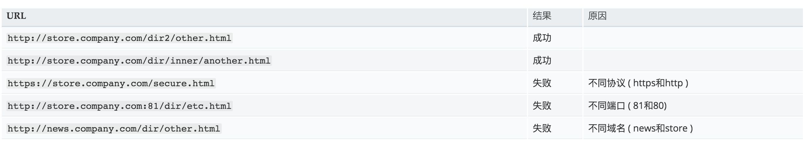
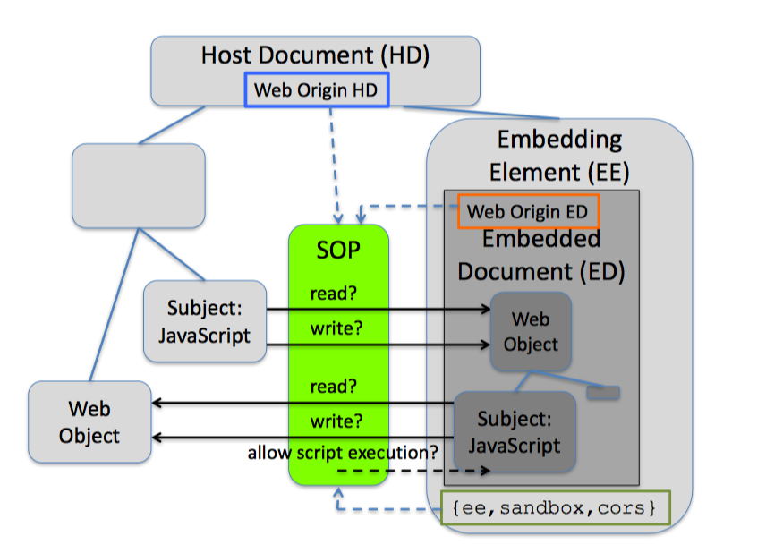

# Web浏览器同源策略综述

> 期末大作业


## 0x00 概要：

同源策略（SOP）是浏览器安全中最重要的一个安全模型之一。随着Web2.0的发展，同源策略在我们的生活中扮演着越来越重要的角色。本文针对同源策略进行了相关的研究与调研，主要从同源策略的实现、遇到的安全挑战以及在不同浏览器中的实现差异等几个方面，进行探究。

## 0x01 同源策略：

同源策略(Same Origin Policy, SOP)用于表示一组复杂的规则[1]，用于管理Web应用程序中不同Web源的交互。这些SOP规则的子集控制主文档和嵌入文档之间的交互。与其他RFC规范相比，它并非一种安全标准，而是一种模型。至今为止，SOP在学术和非学术领域都没有一致的描述。也因此，SOP在不同的客户端上也有着不同的实现，存在细微的差别与冲突。

通俗的讲，同源策略主要用于隔离不同源之间的互相访问操作，从而保证各个网页独立，非法攻击者不能非法窃取页面中的机要信息。

一个源以协议、端口以及主机名标示，只有三者均一致时，才可称两者具有相同的源。

下图给出了相对`http://store.company.com/dir/page.html`同源检测的示例:



<center>图一：同源策略互相访问</center>

同源策略被广泛地应用在处理Web内容的各种客户端上，其可影响的请求有普通的HTTP请求、XMLHttpRequest、XSLT、XBL等等。若两个页面非同源，则将无法读取Cookie、LocalStorage、IndexDB和DOM，且AJAX请求也无法发送。

## 0x02 同源策略的具体实现

同源策略主要用于控制数据之间的读写，其整个工作图大致如下所示[2]：



<center>图二：同源策略的访问机制</center>

同源策略可以分为以下几组的对应规则：

1. DOM 访问

   该子集描述了加载到一个“执行上下文”中的JS代码是否可以访问另一个“执行上下文”中的Web对象。 这包括通过更改Web Origin来修改标准行为，例如，使用document.domain。

2. Local storage和session storage

   该子集定义JS在执行过程中能访问哪些本地存储的Web对象。

3. XMLHttpRequest

   该子集对跨源HTTP网络访问施加了限制。它包含许多ad-hoc规则，其主要概念已在CORS中标准化。

4. Pseudo protocols

   浏览器可以使用类似于javascript:和data:等为协议来表示本地生成的内容，针对这一块同源策略也有一套复杂的规则。

5. Plugins

   很多插件，比如Java、Flash、Silverlight、pdf等等，均带有自己的变体同源策略。

6. Window/Tab

   针对跨窗口通信的能力和属性，同源策略也定义了一套规则集用于保护用户隐私。

7. HTTP Cookie

   该子集用于定义，在哪些源中，HTTP的Cookie将可被读写，以及在哪些请求中，浏览器会自动带上对应的Cookie值。

此外，由于同源策略是一种安全模型，而非标准，其在实现过程中存在细微的差别与冲突。而在这些实现过程中，有以下知识点值得我们注意。

#### IE浏览器的例外

虽然在所有的浏览器都存在DOM访问的同源策略，但是IE浏览器与其他浏览器不同。在IE以外的浏览器中，定义源的项是协议+域名+端口，而在IE中，定义源时不考虑端口，这对在相同域但在不同端口上运行的应用程序造成安全风险。

#### 同源策略与Web2.0

随着Web2.0的发展，我们所知的互联网已经发展成为一个丰富的跨域内容生态系统，为了支持所有这些多样性和变化。简单的DOM和JavaScript命名空间已不再使用，并且需要针对XMLHTTPRequest、JSONP、CORS等进行扩展[3]。

###### 1. JSON Padding (JSONP)

JSONP是利用`<script>`标签的跨域能力实现跨域数据的访问，请求动态生成的JavaScript脚本同时带一个callback函数名作为参数。其中callback函数本地文档的JavaScript函数，服务器端动态生成的脚本会产生数据，并在代码中以产生的数据为参数调用callback函数。当这段脚本加载到本地文档时，callback函数就被调用。

###### 2. PostMessage

postMessage()是ES5新增的一个函数方法，其允许来自不同源的脚本采用异步方式进行有限的通信，可以实现跨文本档、多窗口、跨域消息传递.

语法: `postMessage(data,origin)`

data: 要传递的数据，html5规范中提到该参数可以是JavaScript的任意基本类型或可复制的对象，然而并不是所有浏览器都做到了这点儿，部分浏览器只能处理字符串参数，所以我们在传递参数的时候建议使用`JSON.stringify()`方法对对象参数序列化，在低版本IE中引用json2.js可以实现类似效果.

origin：字符串参数，指明目标窗口的源，协议+主机+端口号[+URL]，URL会被忽略，所以可以不写，这个参数是为了安全考虑，`postMessage()`方法只会将message传递给指定窗口，当然如果愿意也可以建参数设置为”*”，这样可以传递给任意窗口，如果要指定和当前窗口同源的话设置为”/“。

###### 3. Cross-origin resource sharing (CORS)

CORS是H5带来的一种新的跨域请求方式，它相较于前面两者更加安全。前者本身没有能力保证自己不被滥用，而CORS解决了这个问题。

CORS主要作用是，使浏览器不用再一味地禁止跨域访问，而是检查目的响应头域, 进而判断是否允许当前站点访问. 通常, 服务器使用以下的这些响应头域用来通知浏览器:

```html
Response headers[edit]
Access-Control-Allow-Origin
Access-Control-Allow-Credentials
Access-Control-Allow-Methods
Access-Control-Allow-Headers
Access-Control-Expose-Headers
Access-Control-Max-Age
```

CORS的解决办法是在服务端Response的HTTP头域加入资源的访问权限信息.

###### 4. WebSocket

Websocket协议是H5提出的，为了能更好地节省服务器资源和带宽，并实现真正意义上的实时推送。

WebSocket 本质上是一个基于TCP的协议, 它的目标是在一个单独的持久链接上提供全双工(full-duplex), 双向通信, 以基于事件的方式, 赋予浏览器实时通信能力. 既然是双向通信, 就意味着服务器端和客户端可以同时发送并响应请求, 而不再像HTTP的请求和响应.因此，同源策略对Websocket协议并不适用。

## 0x03 安全方面的挑战

同源策略在发展的过程中，也遇到了很多安全方面的挑战，大致如下：

##### 不同SOP上下文导致的安全问题

郑晓峰等人在[4]详细描述了HTTP cookie的SOP安全问题，他们还提出了基于子域的绕过。Borts等人讨论了cookie上下文SOP引起的会话完整性问题[5].Jackson和Barth [6]讨论了不同的SOP背景，并展示了这些背景的相互作用引入的漏洞。 [7]通过显示Web Origins的不同定义，分析了Web浏览器访问控制策略中的一致性; 有DOM对象的web-origin，localStorage和XMLHttpRequest，以及cookie（域，路径）和剪贴板（用户）的其他定义。

#### SOP 绕过

在发展过程中，已经有较多绕过SOP限制的方法发布在学术和非学术领域。Johns等人在[8]中讨论了DNS重绑定攻击（操纵Web起源，从而禁用SOP）以及相应的缓解技术。与此同时，Oren和Keromytis 在[9]中使用混合广播 - 宽带电视（HbbTV）来绕过SOP。 与网站相比，HbbTV数据没有起源。 此特性允许攻击者将他选择的恶意代码注入任何通过HbbTV数据流加载的网站。 另外，Lekies等人在 [5]中使用动态生成的JavaScript文件来攻击受害者的隐私。 

在非学术领域也发现了较多绕过SOP限制的方法。 Jain在 [11]指出，可以在使用文件协议的情况下，绕过Safari v6.0.2的SOP。 在2010年，Stone [12]表明UI修复可以用来绕过SOP。 即使SOP限制脚本级别的访问，也无法限制复制和粘贴以及拖放操作。 在2012年，Heyes [13]发现窗口的位置可以在FF中交叉来源访问，这会引起一些安全问题。 而在2016年，Ormandy [14]发现Comodo的浏览器Chromodo部分地禁用了SOP，因此岂会导致很多安全策略失效。

#### 其他扩展对SOP的影响

此外，在浏览器发展过程中，也出现了很多新的技术，比如扩展、CSP等等。而这些技术的部署，在某些程度上也对SOP产生了影响。比如，在[15]中，王等人提出了具有多主体操作系统架构的安全浏览器Gazelle，并展示了如何实现扩展访问控制策略。Dolière等人在[16]中探讨了CSP策略与SOP策略共同部署中遇到的问题与挑战。[17]提出了一个浏览器扩展系统，用于保护浏览器免受扩展漏洞的影响。 他们重用SOP来隔离攻击扩展，这需要访问浏览器内部和网页数据。 陈等人。


## 0x04 实验

为了更好的研究与分析SOP的部署情况以及在不同浏览器中的工作模式，我参考[18]],撰写与开发了一些模糊测试脚本，主要用于测试不同浏览器对SOP的支持情况，测试结果汇总如下：


<center>图三：实验与测试</center>

在实验中，我们一共撰写了544个测试样本，在10个浏览器进行测试。在整个测试过程中，我们发现了有129个样例在不同的浏览器中存在不一致的支持，大约占整体测试数据的23.71%。

如上所示，我们可以分析发现Windows IE 11浏览器针对CORS的支持较差，几乎都支持CORS的相关请求，而其余的浏览器在通常情况下往往会选择支持CORS，仅在一些细微情况下显示出不同的特征。

此外，在整个实验过程中，我们发现即使是同一公司的浏览器（Safari），但其在不同平台上的实现也展现出一些细微的区别。比如针对Iframe标签的沙箱原始属性，iOS Safari 9 没有进行默认支持，而OSX Safari 9则部分支持。

## 0x05 总结与回顾

本文针对同源策略进行了一些探索与学习。在研究的过程中，通过阅读相关的论文，梳理了在SOP发展过程中遇到的一些安全挑战。此外，为了更实际地了解当前SOP的部署情况，我编写了相关代码在不同的浏览器上进行实验。在实验过程中，我们一共分别在10个浏览器测试了544个测试样本。实验室表明，由于缺乏正式的规范，浏览器对SOP的实现有着细微的差别。在所有的恶测试用例中大约有23%可以检测到不同的浏览器行为。


## 参考：

1. https://en.wikipedia.org/wiki/Same-origin_policy
2. J. Schwenk, M. Niemietz, and C. Manika, “Same-origin policy: Evaluation in modern browsers,” in 26th USENIX Security Symposium (USENIX Security 17). Vancouver, BC: USENIX Association, 2017. 
3. David Petty,Associate Security Analyst, "The Not-So-Same-Origin Policy",[Online] https://www.securityevaluators.com/wp-content/uploads/2018/03/ise_same-origin-policy_whitepaper.pdf
4. X. Zheng, J. Jiang, J. Liang, H. Duan, S. Chen, T. Wan, and N. Weaver, “Cookies lack integrity: Real-world implications,” in USENIX Security 2015. Washington, D.C.: USENIX Association, Aug. 2015, pp. 707–721.
5. A. Bortz, A. Barth, and A. Czeskis, “Origin cookies: Session integrity for web applications,” Online, http://abortz.net/papers/session-integrity.pdf, Web 2.0 Security and Privacy (W2SP), 2011.
6. C. Jackson and A. Barth, “Beware of finergrained origins,” in In Web 2.0 Security and Privacy (W2SP 2008), 2008. [Online]. Available: http://seclab.stanford.edu/websec/origins/fgo.pdf
7. K. Singh, A. Moshchuk, H. J. Wang, and W. Lee, “On the incoherencies in web browser access control policies,” in Proceedings of the 2010 IEEE Symposium on Security and Privacy, ser. SP ’10. Washington, DC, USA: IEEE Computer Society, 2010, pp. 463–478.
8. M. Johns, S. Lekies, and B. Stock, “Eradicating dns rebinding with the extended same-origin policy,” in Proceedings of the 22Nd USENIX Conference on Security, ser. SEC’13. Berkeley, CA, USA: USENIX Association, 2013, pp. 621636. [Online]. Available: http://dl.acm.org/citation. cfm?id=2534766.2534820
9. Y. Oren and A. D. Keromytis, “Attacking the internet using broadcast digital television,” ACM Trans. Inf. Syst. Secur., vol. 17, no. 4, pp. 16:1–16:27, Apr. 2015.
10. S. Lekies, B. Stock, M. Wentzel, and M. Johns, “The unexpected dangers of dynamic javascript,” in USENIX Security 2014, ser. SEC’15. Berkeley, CA, USA: USENIX Association, 2015, pp. 723735.
11. J. Jain, “Sop bypassing in safari,” Online, http://resources.infosecinstitute.com/ bypassing-same-origin-policy-sop-part-2/, Last visited Oct. 2015.
12. P. Stone, “Next generation clickjacking new attacks against framed web pages,” Online, http://www.contextis.com/documents/5/ Context-Clickjacking_white_paper.pdf, April 2010.
13. G. Heyes, “Firefox knows what your friends did last summer,” Online, http://www.thespanner.co.uk/2012/10/10/ firefox-knows-what-your-friends-did-last-summer/, October 2012.
14. Ormandy, “Comodo: Comodo "chromodo" browser disables same origin policy, effectively turning off web security.” https://code.google.com/ p/google-security-research/issues/detail?id=704, Jan. 2016.
15. H. J. Wang, C. Grier, A. Moshchuk, S. T. King, P. Choudhury, and H. Venter, “The multi-principal os construction of the gazelle web browser,” in USENIX Security 2009, ser. SSYM’09. Berkeley, CA, USA: USENIX Association, 2009, pp. 417432.
16. Dolière Francis Some, Nataliia Bielova, and Tamara Rezk. On the Content Security Policy Violations due to the Same-Origin Policy. In Proceedings of the 26th International Conference on World Wide Web, 2017.
17. A. Barth, A. P. Felt, P. Saxena, and A. Boodman, “Protecting browsers from extension vulnerabilities,” in NDSS 2010, 2010.
18. https://github.com/RUB-NDS/your-sop.com