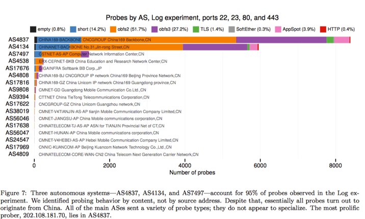

# Examining How the Great Firewall Discovers Hidden Circumvention Servers

**1.**     **论文题目**

**Examining How the Great Firewall Discovers Hidden Circumvention Servers**

作者：Roya Ensafi 、David Fifield、Philipp Winter、Nick Feamster、Nicholas Weaver、Vern Paxson

**2.**     **文章概述**

这篇文章主要是对GFW主动探测行为的研究，文章共探讨了主动探测在发现Tor中继过程中的流程、主动探测的具体行为、探测器的来源在哪、主要的探测器类型有哪些、主动探测器是否有指纹，可以将其与正客户区分开来以及整个主动探测系统的底层架构是什么等问题。研究发现探测者已经放弃2011年Wilde发现的15分钟探测队列，而选择了实时探测功能。而且探测者的IP来源是与普通用户共享IP池的，这使得很难分辨哪些数据是来自探测IP，哪些是来自正常用户。

在不同的网络中的测量，研究者分别在CERNET和Unicom进行了测量，研究发现虽然obfs2、obfs3已经被证实是可以被长城防火墙探测的，但是在实际运行过程中，obfs2、obfs3应用成功建立连接的机率非常大，均大约在90%左右，而vanilla应用则几乎完全被屏蔽，在教育网中也仅有12%的成功率。

此外，探测者的类型也有好几种，有专门的TLS、Tor、Obfs2、Obfs3、SoftEther、AppSpot等类型，分别针对不同的应用场景进行主动探测。一旦探测到规避GFW的协议后，便会将对应IP加入黑名单。整个探测类型分布如下所示：

                                                  

 

在指纹识别方面，作者分别从IP层、TCP层、SSL/TLS层、应用层等方面进行了测量，研究表明探测不仅在各个层会有一些特殊的策略，而且针对应用层的不同具体应用还做了单独的测量，从而达到充分识别出规避节点。

文章还在很多其它方面进行了探测，整个过程中，文章详细的描述了GFW主动探测技术的发展与一些实现细节，它能够检测至少五种规避协议的服务器并定期升级。 文中指出该系统使用了大量的IP地址，并提供了所有这些IP地址都集中控制的证据。

**2.**     **心得体会**

这篇文章主要是一篇偏测量的文章，文章主要测量了长城防火墙在主动探测方面的工作。整个工作做的十分细致，细节很丰富，给予了我们很多针对GFW的细节信息，比如GFW背后的探测策略、GFW的协议探测机制等等。不足方面，文章是在2014年进行了测量，当下GFW应该有了更多的升级，其中的一些策略可能早已弃用，新的策略也已诞生。此外，本文在主动探测的绕过过程中，仅停留在一些简单的原理分析，而没有真正实际测试，并对绕过方式带来的性能开销讨论也过少。针对GFW的主动探测过程中的隐藏技术，也可以成为我们未来的研究兴趣之一。还有便是如何设计一个合理且有效的方案，来逆向探测出整个GFW的网络拓扑结构，及各大节点的位置分布。文中虽然少量提到了这部分内容，但总体讨论的不够深入，还有很大一部分工作值得继续深入。